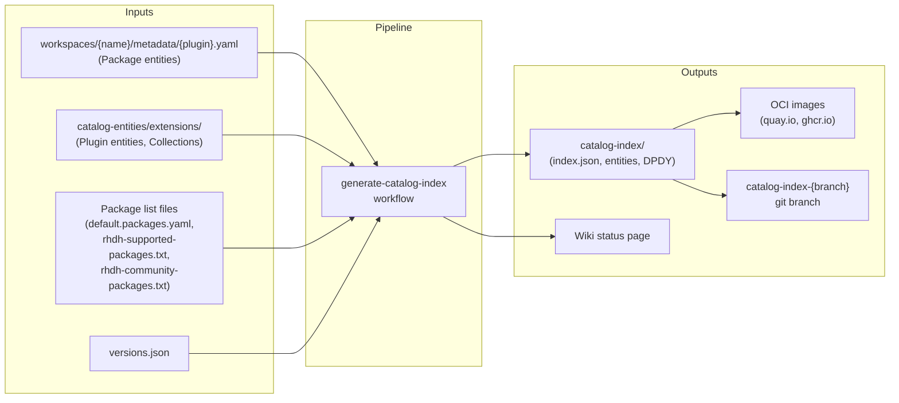
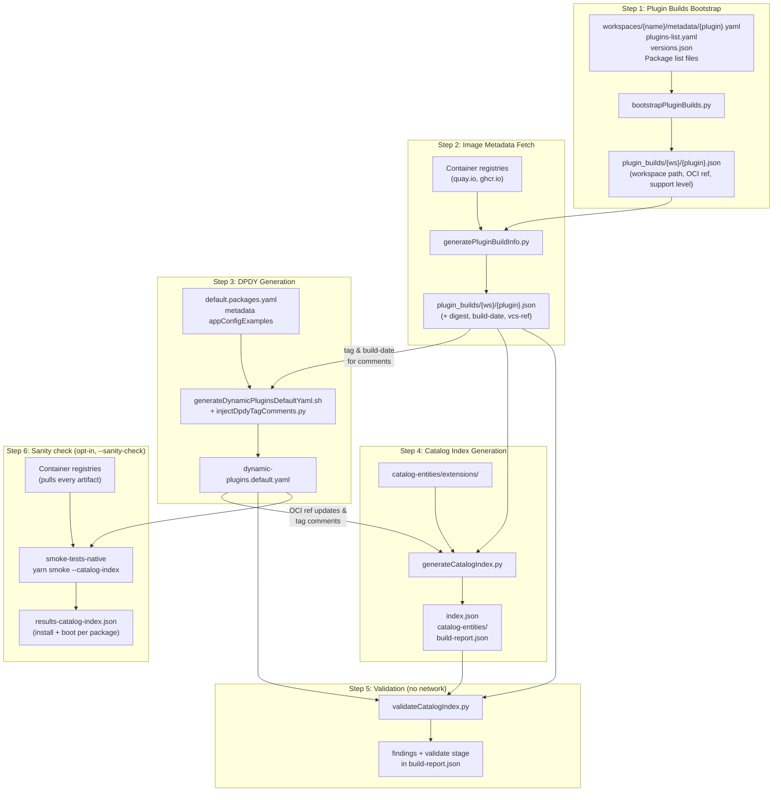

# Plugin Catalog Index

The **plugin catalog indexes** are the collection of **Supported Plugins** and curated **Optional Extras** packages from this repository. 

Indexes can be fetched and used from the links at https://github.com/redhat-developer/rhdh-plugin-export-overlays/wiki/Plugin-Catalog-Status-main 

They contain all the metadata, OCI image references, and default configuration needed for RHDH to discover and load dynamic plugins. This page explains how the catalog indexes are built, what they contain, and where they are published.

---

## Overview

The catalog index generation pipeline reads workspace metadata, queries container registries, and produces a self-contained directory of catalog entities and an `index.json` file. This directory is then packaged as an OCI image and pushed to a container registry, where RHDH consumes it.

Plugin entities under `catalog-entities/extensions/plugins/` can describe plugins that are exported via `workspaces/` **or** plugins whose OCI images are built elsewhere (catalog metadata only). Package bootstrap and registry verification in this pipeline are driven by workspace Package metadata / package lists — catalog-only Plugin YAMLs contribute **listing** metadata to the index, not an overlay export and not installable Package/OCI resolution. **Installable** catalog entries still require Model A workspace Package metadata (`workspaces/*/metadata/`). A future path for catalog-installable external OCI without `workspaces/` is out of scope for this document. See [03 - Plugin Owner Responsibilities](./03-plugin-owner-responsibilities.md#two-ways-a-plugin-can-appear-in-this-repository).

### High-Level Flow




---

## Build Pipeline

The pipeline runs via the `[generate-catalog-index.yaml](../.github/workflows/generate-catalog-index.yaml)` workflow, triggered on pushes to `main` and `release-*` branches when relevant files change, or manually via `workflow_dispatch`.

The core orchestrator script is `[scripts/update-index.sh](../scripts/update-index.sh)`, which runs six steps in sequence — four that build the index, and two that check it:




### Step 1: Plugin Builds Bootstrap (`bootstrapPluginBuilds.py`)

Reads each `workspaces/*/metadata/*.yaml` file and constructs initial `plugin_builds/<workspace>/<image-name>.json` entries. Each entry includes the workspace path, support level, and a constructed OCI tag reference based on the registry type:

- **ghcr.io**: `bs_{backstage_version}__{plugin_version}` (e.g., `bs_1.49.4__0.8.2`)
- **quay.io/rhdh**: `{rhdh_version}--{plugin_version}` (e.g., `1.10--0.8.2`)

Plugins are filtered to only those matching the provided `--packages-file` list(s).

Orphan cleanup after renames/removals (e.g. lightspeed → intelligent-assistant): JSON files under `plugin_builds/` that are no longer produced from metadata are deleted, and matching orphan keys are removed from `--report-file` (`build-report.json`) so later steps and `renderCatalogStatus.py` do not keep advertising obsolete OCI refs.

### Step 2: Image Metadata Fetch (`generatePluginBuildInfo.py`)

Queries the container registry for each plugin's OCI image to retrieve:

- **Digest** (`sha256:...`) for immutable references
- **Build date** and **VCS ref** from container labels
- **Upstream/midstream** repo refs from container env vars

Then updates `plugin_builds` with the relevant metadata.
Images that don't exist in the registry are logged as warnings.

#### Tag Resolution Strategy

For each plugin, the image metadata fetch follows a three-tier resolution:

1. **Exact tag match**: The constructed tag (e.g., `1.10.0--1.5.4`) is queried directly. If the image exists, its metadata is used as-is.

2. **RHDH version alias** (quay.io/rhdh only): If the exact tag is not found and the RHDH version prefix has three parts (x.y.z), the patch version is stripped to try the minor-version alias (e.g., `1.10.2--` → `1.10--`). This is because downstream builds are not repeated for each RHDH patch release if the plugin hasn't changed — a build done during `1.10.0` produces both `1.10.0--1.5.4` and `1.10--1.5.4` tags, and the `1.10--` alias remains valid for `1.10.1`, `1.10.2`, etc. If the exact plugin version is found under the alias, the resolved reference is used without marking it as a fallback. If the alias has tags but not the exact plugin version, the plugin is reported as not found — a new downstream build is needed.

3. **Fallback to latest version**: If the exact plugin version is not found under the original prefix, the latest published plugin version within that prefix is used. This is flagged as a fallback in the output, and the metadata YAML's `version:` field is updated to match. Fallback only applies within the original prefix — the alias (minor-version) prefix is only used for exact matches.

Alias resolution does not apply to ghcr.io (community) builds, which use Backstage version prefixes (`bs_x.y.z__`).

### Step 3: DPDY Generation (`generateDynamicPluginsDefaultYaml.sh`)

Generates `dynamic-plugins.default.yaml` — the default plugin configuration shipped with RHDH. This step only runs for the **supported** tier (requires a YAML-format packages file with enabled/disabled structure).

After generating the DPDY, the script calls `injectDpdyTagComments.py` to insert `# Tag: <tag>, Build date: <date>` comments from `plugin_builds/*.json` (produced by Steps 1-2). Each plugin's `registryReference` tag and `build-date` label are extracted from the enriched JSON files and placed as comments above the corresponding `- package:` lines. This provides traceability from each plugin entry back to the specific OCI image tag and build date, without requiring live registry API calls (which previously caused Quay API timeouts).

Inputs:

- `default.packages.yaml` — lists which plugins are enabled vs disabled by default
- `workspaces/*/metadata/*.yaml` — `spec.appConfigExamples[0].content` provides the `pluginConfig` for each plugin
- `plugin_builds/*.json` — provides tag and build-date metadata for comment injection

Output structure (truncated):

```yaml
plugins:
  # Tag: 1.10--0.8.2, Build date: 2026-05-20T13:45:25Z
  - package: oci://quay.io/rhdh/red-hat-developer-hub-backstage-plugin-adoption-insights:1.10--0.8.2
    enabled: true
    pluginConfig:
      dynamicPlugins:
        frontend:
          red-hat-developer-hub.backstage-plugin-adoption-insights:
            # ... frontend wiring config
  # Tag: 1.10--1.2.0, Build date: 2026-05-19T09:12:00Z
  - package: oci://quay.io/rhdh/backstage-community-plugin-acr:1.10--1.2.0
    enabled: false
```

### Step 4: Catalog Index Generation (`generateCatalogIndex.py`)

The final step that produces the catalog index:

1. Copies `catalog-entities/extensions/` (Plugin entities, collections) to the output directory
2. Copies `workspaces/*/metadata/*.yaml` (Package entities) to the `packages` directory of the catalog index output directory
3. Scrubs entities to only include packages matching the package list filter
4. Verifies each plugin's OCI image exists in the registry
5. Generates `index.json` with digest-based references
6. Updates Package entity files and DPDY with OCI references and Tag/Build date comments
7. Regenerates `all.yaml` location files

### Step 5: Validation (`validateCatalogIndex.py`)

A static check of what the previous steps just produced. **No network calls** — it reads
`dynamic-plugins.default.yaml`, `index.json` and `plugin_builds/` and reports where they
disagree, so it is cheap enough to run on every generation, upstream and in the midstream
Konflux pipeline alike.

It exists because the generator is deliberately forgiving: when a plugin's image is not
found in the registry it logs a warning and carries on, so the index can go out declaring
an `oci://` ref that was never confirmed to exist. Nothing downstream re-checked that.

Run `python3 scripts/validateCatalogIndex.py --list-rules` for the full list. The ones
that matter most:

| Rule                   | Severity | What it means                                                                                             |
| ---------------------- | -------- | --------------------------------------------------------------------------------------------------------- |
| `unresolved-image`     | error    | The index ships a package whose image was never resolved. Enabling it fails at pull time.                 |
| `unknown-image`        | error    | An `oci://` ref names an image with no `plugin_builds/` entry — the index and build metadata disagree.     |
| `digest-mismatch`      | error    | A digest-pinned ref does not match the digest `plugin_builds/` recorded.                                  |
| `registry-not-allowed` | error    | A ref points at a registry this index is not built against (the `ghcr.io`-into-`quay.io/rhdh` leak).      |
| `duplicate-ref`        | error    | The same ref appears twice; the later entry silently shadows the earlier one's `pluginConfig`.             |
| `fallback-tag`         | warning  | The requested build was missing and an older tag was substituted — the index ships a stale build.          |
| `not-digest-pinned`    | warning  | A ref carries a tag rather than a digest, so what it resolves to can change under the index.               |
| `index-missing-entry`  | warning  | A resolved package is in the DPDY but absent from `index.json`, so the Extensions UI will not list it.     |

**Modes.** `--validate-mode` controls what a finding does to the build:

- `report` (**default**) — always runs, prints the findings, never fails the build.
- `gate` — fails the build on any error.
- `off` — skips the step.

The default is `report` on purpose. The check is new, and the indexes it runs against
today already carry findings nobody has triaged; landing it as a hard gate would turn
those into a red build for whoever happens to push next. **Flip it to `gate` once the
standing findings are fixed or allowlisted** — that is the point of shipping it.

**Allowlist.** Known and accepted findings go in
[`scripts/catalog-index-validation-allowlist.txt`](../scripts/catalog-index-validation-allowlist.txt),
using the same `TODO(TICKET)` discipline as the smoke harness's exclusion files: a
pattern with no ticket is a parse error, so exceptions get removed rather than
accumulated. Patterns are matched against the OCI **image name**
(`backstage-community-plugin-quay`).

Findings are also recorded per plugin in `build-report.json` as a `validate` stage, so
they reach the generated status page. Only errors set that stage to `fail` — a stale tag
should not turn a plugin red and drown the ones that really are broken.

**It only checks a tier that has a DPDY.** Every rule is driven by
`dynamic-plugins.default.yaml`, and Step 3 generates that file only when a
`default.packages.yaml` is among the `--packages-file` arguments. The community tier is
generated with `--packages-file rhdh-community-packages.txt` alone, so for that tier
Step 5 logs `nothing to validate` and exits 0 — including under `--validate-mode gate`.
It says so in the log rather than passing silently, but do not read a green community
run as a validated one.

### Step 6: Catalog Index Sanity Check (opt-in)

Installs and boots **every** package the generated index declares, using the Docker-free
[`smoke-tests-native`](../smoke-tests-native/README.md) harness — the install CLI plus
`startTestBackend`, no container and no cluster. This is the upstream half of RHDH's
cluster-free plugin sanity check (RHIDP-13508), running against the index as it is about
to be published rather than against an index image that already exists.

It is **off by default** (`--sanity-check` opts in) because it pulls every artifact the
index declares and needs Node 24 and Yarn 4, which the midstream `update-index` GitLab
job has neither the budget (1 CPU / 2Gi, 30-minute script timeout, today doing metadata
lookups only) nor the toolchain for.

Two things about how it reads the index are worth knowing:

- **The index's `enabled:` flags are ignored.** Most packages ship `enabled: false`
  because that is RHDH's out-of-the-box default, which says nothing about whether the
  artifact works. Honouring them would validate almost nothing, so the check generates an
  enable-everything config — the same reasoning behind RHDH's `populate-catalog-index.sh`.
- **`pluginConfig` blocks are dropped.** They reference `${ENV_VAR}` placeholders that
  exist in a deployed RHDH and nowhere here. The harness supplies its own dummy root
  config instead, with `--app-config` layered on top.

Packages that genuinely cannot be validated go in
[`smoke-tests-native/catalog-index-sanity-excludes.txt`](../smoke-tests-native/catalog-index-sanity-excludes.txt),
again with a tracking ticket per entry.

```bash
# Against the index this repo is about to generate
scripts/update-index.sh --registry quay.io/rhdh --validate-mode gate --sanity-check

# Against an index that is already published
scripts/extractCatalogIndex.sh quay.io/rhdh/plugin-catalog-index:next /tmp/dpdy.yaml
cd smoke-tests-native && yarn smoke --catalog-index /tmp/dpdy.yaml
```

On a schedule, this runs as the
[Catalog Index Sanity workflow](../.github/workflows/catalog-index-sanity.yaml)
(04:00 UTC daily, plus `workflow_dispatch` with a `catalog_index_image` input for RC
verification). It is not a PR check, for the same reason RHDH's is not: the index changes
on its own, so a PR here cannot change what the job validates, and running it per-PR would
fail unrelated work whenever the index drifts.

When validating a **published** index there is no `plugin_builds/` alongside it, so pass
`--no-build-metadata` to `validateCatalogIndex.py`. It skips the rules that need the build
metadata — each one declares that in its own row of the rule table, so the list cannot
drift — and names them in its output, so a pass cannot be mistaken for a full check.

---

## Output Artifacts

The generated `catalog-index/<tier>/` directory contains:


| File                                             | Purpose                                                                                   |
| ------------------------------------------------ | ----------------------------------------------------------------------------------------- |
| `index.json`                                     | Main index mapping plugin image names to OCI refs with digests                            |
| `catalog-entities/extensions/packages/*.yaml`    | Package entity definitions with resolved OCI references                                   |
| `catalog-entities/extensions/plugins/*.yaml`     | Plugin entity definitions (descriptions, icons, categories)                               |
| `catalog-entities/extensions/collections/*.yaml` | Collection groupings (featured, recommended, etc.)                                        |
| `dynamic-plugins.default.yaml`                   | Default plugin configuration (supported tier only)                                        |
| `build-info.json`                                | Build metadata (date, versions, source commit)                                            |
| `build-report.json`                              | Detailed per-plugin build status with stage tracking (not included in final OCI artifact) |


---

## Support Tiers

The pipeline runs twice per build — once for each tier.

Inclusion in either catalog is **optional** for plugin owners and requires RHDH PM approval. For the owner-facing files and checklist (Plugin entity YAML, collections if applicable, `all.yaml`, package list files, and GA-only `default.packages.yaml` with `enabled:` / `disabled:`), see [03 - Plugin Owner Responsibilities](./03-plugin-owner-responsibilities.md#1-keep-plugin-metadata-and-catalog-curation-files-up-to-date).

### Supported Plugins Catalog

Plugins with Red Hat support (GA or Tech Preview heading to GA).

- **Filter**: Union of `default.packages.yaml` (GA only) + `rhdh-supported-packages.txt` (GA + TP)
- **Registry**: `quay.io/rhdh` (plugins registry) / `quay.io/rhdh-community` (catalog index image registry)
- **Published to**: `quay.io/rhdh-community/plugin-catalog-index`
- **Tags**: `bs_{backstage_version}-{short_sha}`, `bs_{backstage_version}`, `latest`
- **Includes DPDY**: Yes

### Curated Optional Extras Catalog

Curated Optional Extras (community, developer preview, and non-core) plugins. The package-list file selects this **catalog tier**; support level remains in Plugin/Package metadata YAML.

- **Filter**: `rhdh-community-packages.txt`
- **Registry**: `ghcr.io/redhat-developer/rhdh-plugin-export-overlays`
- **Published to**: `ghcr.io/redhat-developer/rhdh-plugin-export-overlays/plugin-catalog-index`
- **Tags**: `bs_{backstage_version}-{short_sha}`, `bs_{backstage_version}`, `latest`
- **Includes DPDY**: No

---

## Where to Find Status

After each build, a status page is automatically pushed to the GitHub Wiki:

- **Index page**: [Plugin Catalog Index Status](https://github.com/redhat-developer/rhdh-plugin-export-overlays/wiki/Plugin-Catalog-Index-Status) — links to all branch status pages
- **Per-branch pages**: `Plugin-Catalog-Status-{branch}` — shows which plugins passed/failed and why

The status page includes:

- Build metadata (date, commit, versions)
- Summary counts per tier (total, passed, failed)
- Per-plugin tables with links to metadata files, OCI references, and failure reasons
- Links to the workflow run for debugging failures

The raw `build-report.json` files are also available on the `catalog-index-{branch}` git branch in `catalog-index/supported/build-report.json` and `catalog-index/community/build-report.json`.

---

## Triggering a Build

### Automatic

Pushes to `main` or `release-*` branches that modify any of these paths trigger the workflow:

- `workspaces/*/metadata/*.yaml`
- `catalog-entities/extensions/**`
- `default.packages.yaml`, `rhdh-supported-packages.txt`, `rhdh-community-packages.txt`
- `scripts/**`
- `versions.json`

### Manual

```bash
# Build from main, push to catalog-index-main
gh workflow run generate-catalog-index.yaml

# Build from a specific branch
gh workflow run generate-catalog-index.yaml -f source-branch=release-1.9

# Build from one branch, push catalog to a custom target branch
gh workflow run generate-catalog-index.yaml \
  -f source-branch=main \
  -f target-branch=catalog-index-custom
```

## Extracting Content From a Catalog Index Image

To pull just `dynamic-plugins.default.yaml` out of a published index — which is what the
sanity check needs, and what RHDH's own check reimplements — use
[`scripts/extractCatalogIndex.sh`](../scripts/extractCatalogIndex.sh):

```bash
scripts/extractCatalogIndex.sh quay.io/rhdh/plugin-catalog-index:next /tmp/dpdy.yaml
```

The index image is `FROM scratch`, so there is nothing in it to exec and the file has to
come out of a layer. The script walks the manifest **top-down** and takes the first layer
carrying the file: layers are listed base-first, and an index rebuilt as an overlay keeps
a stale copy in a lower layer — reading that one would validate the previous index while
reporting on the current one.

To browse the whole tree instead, run this script:

```
unpack () {
  if [[ ! $1 ]]; then
    echo "Usage: unpack reg/org/container:tagorsha"
  else  
    local IMAGE="$1"
    DIR="${IMAGE//:/_}"
    DIR="/tmp/${DIR//\//-}"
    rm -fr "$DIR"; mkdir -p "$DIR"; container_id=$(podman create "${IMAGE}")
    podman export $container_id -o /tmp/image.tar && tar xf /tmp/image.tar -C "${DIR}/"; podman rm $container_id; rm -f /tmp/image.tar
    echo "Unpacked $IMAGE into $DIR"
    cd $DIR; tree -d -L 3 -I "usr|root|buildinfo"
  fi
}

unpack ghcr.io/redhat-developer/rhdh-plugin-export-overlays/plugin-catalog-index:1.11-bs_1.49.4 
unpack quay.io/rhdh-community/plugin-catalog-index:<some tag>
```
Once unpacked, you should see a tree of metadata files to browse, as well as `index.json` and `build-info.json`.

```
.
└── catalog-entities
    └── extensions
        ├── collections
        ├── packages
        └── plugins
```
