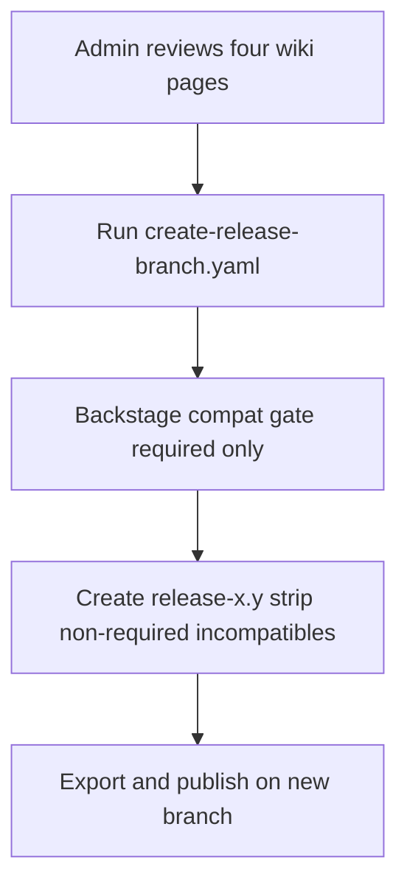

# Creating Release Branches

This runbook is for **repository admins** with write access. It explains what to verify on `main` before cutting a `release-x.y` branch, and how to run the Create Release Branch workflow.

Plugin owners who need to **update** an existing release branch should use [05 - Version Updates](./05-version-updates.md#release-branch-considerations) instead.

---

## When to Create a Release Branch

Create a `release-x.y` branch from `main` when an RHDH release line needs a long-lived overlay branch. After creation:

- The branch tracks that RHDH release's plugin set.
- Only updates to **existing** workspaces are accepted; new workspaces are not added automatically.
- Scheduled daily ref discovery does **not** run on release branches (manual updates only).

---

## Pre-Flight Checklist

Review these wiki reports for **`main`** before running the workflow. Only Backstage compatibility for **required** plugins is enforced automatically; the rest is human judgment.

| Report | What to check |
|--------|----------------|
| [Backstage Compatibility Report](https://github.com/redhat-developer/rhdh-plugin-export-overlays/wiki/Backstage-Compatibility-Report) | **Hard gate.** Mandatory (required) workspaces must be compatible with the target Backstage version. Incompatible non-required workspaces are removed from the new branch when it is created. |
| [NFS Readiness Report](https://github.com/redhat-developer/rhdh-plugin-export-overlays/wiki/NFS-Readiness-Report) | Confirm New Frontend System readiness for plugins that matter to the release. |
| [Workspace Status (`main`)](https://github.com/redhat-developer/rhdh-plugin-export-overlays/wiki/main) | Spot metadata, ref, or version issues on workspaces you intend to keep. |
| [Plugin Catalog Status (`main`)](https://github.com/redhat-developer/rhdh-plugin-export-overlays/wiki/Plugin-Catalog-Status-main) | Confirm catalog index health for packages that ship on the release line. |

Required plugins come from the union of `rhdh-supported-packages.txt` and `rhdh-community-packages.txt` on `main`. If a required workspace is Backstage-incompatible, the workflow fails and the branch is not created.

---

## Run the Workflow

Write access to this repository is required.

### Option 1: GitHub Actions UI

1. Open [Create Release Branch](https://github.com/redhat-developer/rhdh-plugin-export-overlays/actions/workflows/create-release-branch.yaml).
2. Choose **Run workflow**.
3. Use workflow from **`main`**.
4. Set **release-branch** to the new name (for example `release-2.1`).
5. Run the workflow and watch the `check`, `create`, and `export` jobs.

### Option 2: GitHub CLI

```bash
gh workflow run create-release-branch.yaml \
  -f release-branch=release-2.1
```

Add `-f debug=true` only when diagnosing script failures.

---

## What the Workflow Does

The workflow file is [`.github/workflows/create-release-branch.yaml`](../.github/workflows/create-release-branch.yaml).

1. **Prepare required plugins** — concatenates `rhdh-supported-packages.txt` and `rhdh-community-packages.txt`.
2. **Backstage compatibility check** — runs against `main` with `fail-for-required-only: true`. Required incompatibilities fail the run; non-required incompatibilities are listed for removal.
3. **Create the branch** — checks out `main`, creates `release-x.y`, deletes incompatible non-required workspace folders, and verifies every required plugin still exists in that workspace's `plugins-list.yaml`.
4. **Push and export** — pushes the new branch and triggers dynamic-plugin export/publish for that overlay branch.



---

## After Creation

1. Confirm the branch exists: `git fetch origin release-x.y` (or open it on GitHub).
2. When generated reports refresh, check the new line's [Workspace Status Reports](https://github.com/redhat-developer/rhdh-plugin-export-overlays/wiki/Workspace-Status-Reports) and [Plugin Catalog Index Status](https://github.com/redhat-developer/rhdh-plugin-export-overlays/wiki/Plugin-Catalog-Index-Status) pages for `release-x.y`.
3. For later workspace updates on that branch, follow [Updating Release Branches](./05-version-updates.md#updating-release-branches).
